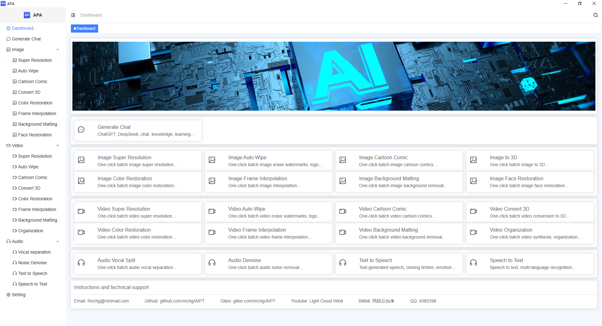
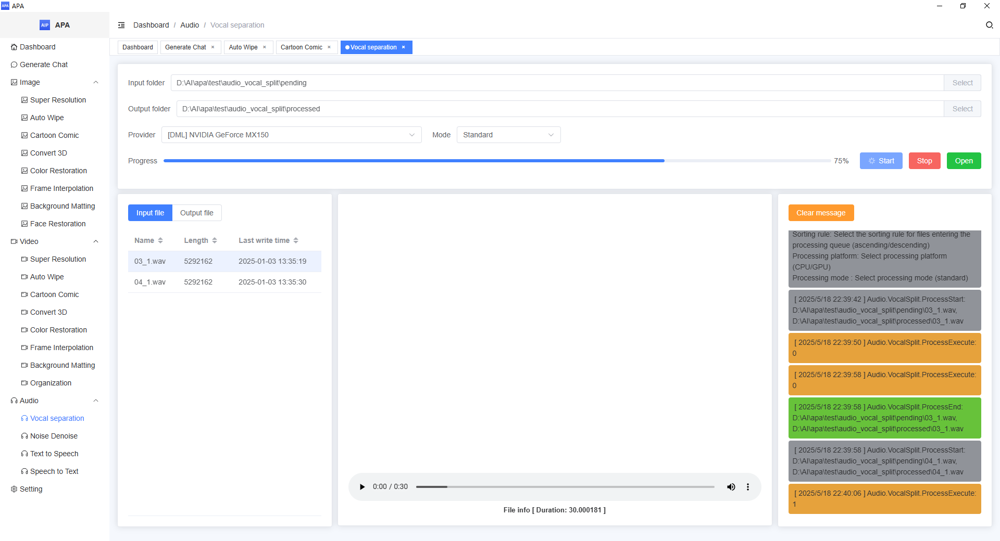

| English | [中文](README.zh-CN.md) |

# AI Productivity Assistant
Free and open source, improve user productivity, and protect privacy and data security. Provide efficient and convenient AI solutions, including but not limited to: built-in local exclusive ChatGPT, DeepSeek, one-click batch intelligent processing of pictures, videos, audio, etc.

## Main features
- **Free and open source**: free to use, open source code, users can check and modify it by themselves.
- **Privacy protection**: local deployment, all data is processed locally to ensure user privacy and data security.
- **Offline use**: no need to connect to the Internet, it can run offline to avoid the impact of network restrictions.
- **No installation and configuration**: no installation and configuration, just unzip and start running with one click, convenient and fast.
- **Multi-language support**: support multi-language internationalization to meet the needs of global users.

## Integrated AI model
Integrated with a variety of latest AI models, you can use the built-in exclusive ChatGPT and DeepSeek in the local offline environment, and one-click batch intelligent processing of pictures, videos, audio, etc.

### Generate
- **DeepSeek**: Provides a local offline DeepSeek model, allowing you to enjoy the intelligent AI conversation experience anytime, anywhere.

### Image
- **Image lossless enlargement**: Improves image resolution to ensure lossless image quality.
- **Image watermark erasure**: Erase watermarks, subtitles, and logos from images to restore the original image.
- **Image cartoon comics**: Convert images to vivid cartoon or comic styles.
- **Image to 3D**: Convert images to realistic 3D scenes.
- **Image coloring and repair**: Recolor old photos and give them a new lease of life.
- **Image interpolation and frame filling**: Automatically generate frame filling images for images.
- **Image background removal**: Easily remove the background of an image and export a transparent background image.
- **Image face repair**: Repair blurred or damaged face images and enhance details.

### Video
- **Video lossless enlargement**: Increase video resolution and keep the image quality clear.
- **Erase watermark from video**: Erase watermarks, subtitles, and logos from videos to restore the original picture.
- **Cartoon video**: Convert videos to fun cartoon or comic styles.
- **Convert video to 3D**: Convert videos to immersive 3D effects.
- **Color and repair video**: Recolor old videos to experience new visual effects.
- **Interpolation and frame filling of video**: Increase the video frame rate for smoother playback.
- **Background removal from video**: Easily remove the background of the video and replace the background conveniently.
- **Video synthesis and arrangement**: Decrypt, synthesize, and organize the downloaded cached video files.

### Audio
- **Voice separation from audio**: Accurately separate the human voice and accompaniment in the audio, and restore the original accompaniment, human voice, etc.
- **Noise removal from audio**: Intelligently identify and remove interference noise in the audio, and restore the clear original sound.
- **Audio cloning generation**: Generate cloned sounds based on the text content, accurately restore the timbre, emotion, and speech speed.
- **Audio to text**: Intelligent real-time analysis of speech, automatic generation of text content.

### Supported platforms
|Operating system|Status|Notes|
|---|---|---|
|Windows|Released|Windows 10 x64 1709+|
|Android|Under development||
|iOS|Under development||
|Mac|Planning||
|Linux|Planning||

### Future plans
We will continue to integrate and optimize more AI models to meet the diverse needs of users.

### Open source and download address
- | [Github](https://github.com/rnchg/Apa/releases/latest) | [Gitee](https://gitee.com/rnchg/apa/releases/latest) | [Google Drive](https://drive.google.com/drive/folders/1WgallXe2G0jo0fKyFYWFnWJLuksqSqWb) | [Baidu Drive](https://pan.baidu.com/s/1k-IBphtLJuXQBSbp2b2Bew?pwd=1234) | [Tencent Cloud](https://share.weiyun.com/iyKCgmZL) |

### Instructions and technical support
- **Email**: [Rnchg@Hotmail.com](mailto:Rnchg@Hotmail.com)
- **Github**：[github.com/rnchg/Apa](https://github.com/rnchg/Apa) 
- **Gitee**：[gitee.com/rnchg/apa](https://gitee.com/rnchg/apa) 
- **Youtube**: [Light Cloud Wind](https://www.youtube.com/channel/UCHKH3bLpd8giPyr6x5sKGfw) 
- **Bilibili**: [The wind is clear and the clouds are clear](https://space.bilibili.com/478375442) 
- **QQ**：6085398 

### Running interface
Home

Generate dialogue

Image processing

Video processing

Audio processing

Settings

### Donation support
If you find this project useful, you can buy the author a cup of coffee.
